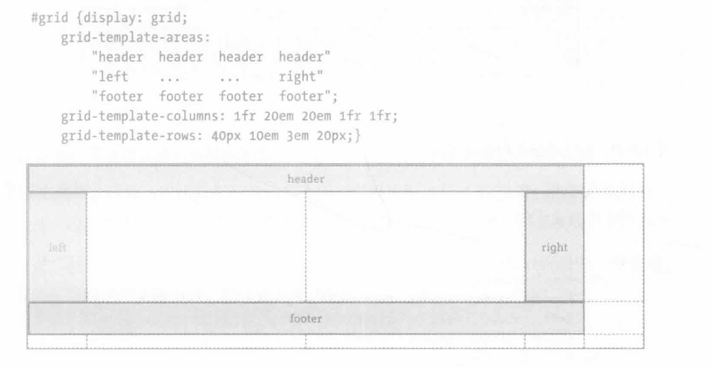
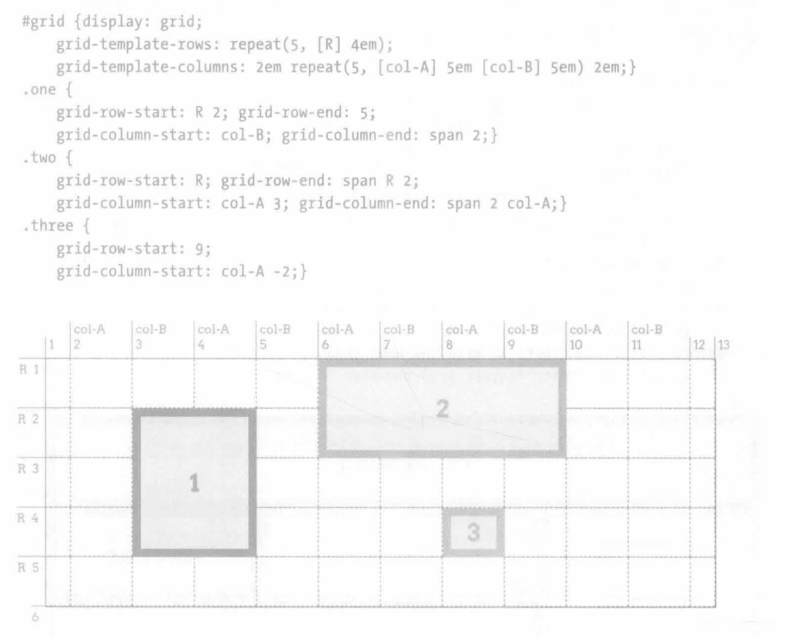

# 12 Flexbox布局
- 能让元素对不同的屏幕尺寸做好适应
- 盒指明空间的分布方式、内容的对齐方式和元素的视觉顺
- 盒依赖父子关系
- 在元素上声明display：flex或display：inline-flex该元素随之成为弹性容，控制子元素的布局
- 有直接子元素称为弹性元素
- **弹性盒的目的是实现一种特定的布局，即一维内容分布。也就是说，弹性盒最适合沿一个方向（或轴）布置内容。**
- 有时子元素的数量却不在我们的掌控之中，可能也不知道容器的宽度，使用弹性盒都能轻易解决

## 应用在弹性容器的属性
- **flex-direction**
如果你想要的布局是从上到下、从左至右、从右至左的，抑或是从下到上的，可以使用**flex-direction属性**控制排布弹性元素的主轴。
是从上到下、从左至右、从右至左的，抑或是从下到上
可以的值是row(默认) row-reverse column column-reverse
- **flex-wrap**
元素在弹性容器的主轴上放不下，默认情况下弹性元素不会换行，也不会自行调整尺寸，边界溢出
flex-wrap属性，允许弹性元素换行，变成多行或多列，或者缩减尺寸，挤在同一行。
取值nowrap wrap上 wrap-reverse

flex-flow属性是flex-direction和flex-wrap两个属性的简写形式

- **justify-content**
分配子元素的空余空间。
flex-start|flex-end|center|space-between|space-around|space-evenly

- **align-items**
决定容器内项目在竖直方向上的排列
stretch|flex-start|flex-end|center|baseline

- **align-content**
控制多行如何对齐
stretch|flex-start|flex-end|center|space-between|space-around|space-evenly

- **align-self**
为容器中的某个项目单独指定对齐方式
auto|stretch|flex-start|flex-end|center|baseline

---

- 依赖父子关系
- 容器显示为块or行内？display: flex; displ: inline-flex
- 弹性元素布局方向flex-direction
- 元素太多，容器空间不够怎么办，减小元素尺寸还是是否允许换行flex-wrap
- 空白怎么处理？主轴：justify-content 垂轴：align-items  align-self
- 元素对齐
- 一维

- flex-direction 4
- flex-wrap 3
- justify-content 6
- align-items 5
- align-self 6
- align-content 7

---

## 弹性元素
flex-grow、flex-shrink和flex-basis属性用于控制弹性元素的弹性。
这里所说的弹性是指弹性元素在主轴方向上可以增加或缩减多少尺寸。
它们可以简写为flex

如果 flex 简写属性没有显式声明增长因子（flex-grow）和缩减因子（flex-shrink），
则：增长因子 默认为 0。
缩减因子 默认为 1。

flex接受常规的全局属性值，包括initial、auto和none
initial 是一个 全局值，将属性恢复为默认值。flex: 0 1 auto;
auto 是 flex 的默认值，表示项目的大小由内容的自然宽度或高度决定。flex: 1 1 auto;
none 是一个特殊的值，表示不允许元素在容器中伸展、收缩，元素的大小将由 flex-basis 决定，flex: 0 0 auto;
flex: <number> 这个值把弹性元素的增长因子设为<number>指定的数，同时把缩减因子设为0，把基准也设为0。

如果是宽度不一样 缺少的空间/（（宽度1×缩减因子1）+...+（宽度N×缩减因子N））

flex-basis在分配空间前的初始尺寸，它可以是像素（px）或其他单位，默认为 auto（即项目的原始尺寸）。

min-width 是一个 CSS 属性，用于设置元素的 最小宽度，即元素的宽度不能小于该值。即使容器的宽度不足以容纳该元素，元素的宽度也不会小于 min-width 设置的值。
如果元素的实际内容宽度大于 min-width，那么这个元素的宽度将 根据内容的宽度自动扩展，而不会受 min-width 的限制。

order属性用于修改单个弹性元素/组的显示顺序

---

- flex-grow
- flex-shrink
- flex-basis
- min-width
- order - 0 +
- flex 4

---

----------------------------------------------------------------------------------------------------

# 13 栅格布局
栅格布局是普适的布局系统。依赖行和列栅格之内可以嵌套栅格，层级不限，而且还可以在栅格中使用表格或弹性容器

栅格布局还有子栅格这个概念，它与嵌套的栅格容器不是一回事

栅格有两种：常规栅格和行内栅格。这两种栅格使用display属性的特殊值创建：grid和inline-grid

其中的元素根据栅格布局（而非块级布局）规则排布，表格自身就是一种栅格系统

- 栅格轨道gridtrack
- 栅格单元gridcell
- 栅格区域gridarea

grid-template-rows,grid-template-columns
取值none|<track-list>|<auto-track-list>

栅格线可以使用数字引用，为其命名又或者二者混用一条栅格线可以有多个名称
行和列不共用命名空间，因此可以像这样在两个上下文中重用名称。

---

来看看宽度固定的栅格轨道
grid-template-columns:[start col-a] 200px [col-b] 50% [col-c] 100px [stop end last];
[content] minmax（3em,100%)

grid-template-columns:1fr 1fr 1fr 1fr;
grid-template-columns:25%25% 25% 25%;

假设我们想增加一列，而且确保每一列的宽度仍是相等的。如果使用百分数，我们要重写整个值，把各列的尺寸改为20%。但是使用fr的话，只需再加一个1fr即可

处理fr单位的方式是，拿可用空间除以fr值之和，各轨道的尺寸等于fr值所对应的份数

假如你想得到三列，中间一列的宽度为其他两列的两倍。那么，可以这样声明：grid-template-columns:1fr 2fr 1fr;

但fr可不只是百分数的替代品这么简单，它还有更强大的功能
grid-template-columns:15em 1fr 10%;
不管余下多少空间，都分给中间一列
混用百分数和 fr 单位例如：minmax(10%, 1fr) 表示列的宽度：不小于容器宽度的 10%。如果有剩余空间，可以进一步扩展。

## 弹性栅格轨道
想确保第三列的宽度不小于5em，可以把CSS声明改为：grid-template-columns:15em 4.5fr minmax(5em,3fr) 10%;

## 根据内容设定轨道的尺寸
min-content、max-content、auto minmax()函数结合

max-content:表示“占据内容所需的最大空间”。当用于栅格布局时，每个轨道的宽度或高度会根据轨道中最大内容的尺寸调整。
如果把一列的尺寸设为max-content，那么整个列轨道的宽度都与列中最宽的内容一样。
这样做的好处是，内容可以是任何类型。如果为照片加上描述文字，所有行和列的尺寸都会调整，以便放下文本和图像
max-content经常出现在minmax（）语句中。

min-content:表示“尽量少占据空间，但足够显示内容”。
minmax(min-content, max-content)：轨道宽度介于最小内容宽度和最大内容宽度之间。
minmax():用于设置轨道尺寸的上下限。minmax(0, max-content)：轨道宽度从0到最大内容宽度，但不会溢出栅格容器。

fit-content()先确定min-content和指定的参数哪个大，然后拿较大的那个值与max-content相比，找出较小的

repeat（）
假设我们想每隔5em放置一条列栅格线，而且一共有10个列轨道。使用repeat（）的写法如下：#grid {display:grid;grid-template-columns:repeat(10,5em);}就这样，我们创建了10个列轨道，每个轨道的宽度为5em，共计50em。显然，这比输入10次5em节省时间。
或者这样`grid-template-columns:repeat(3,2em 1fr 1fr) 2em;}`

假设我们想让前面的行模式一直重复，只要不撑破栅格容器即可：grid-template-rows:repeat(auto-fill,[top] 5em [bottom]);此时，每隔5em放置一条行栅格线，直到没有空间为止。因此，对11em高的栅格容器来说等效于下述声明：grid-template-rows:[top] 5em[bottom top]5em[bottom];如果栅格容器的高度超过15em，但是小于20em，那么等效于下述声明：grid-template-rows:[top] 5em [bottom top] 5em[top bottom] 5em[bottom];

在一个轨道模板中只能有一个自动重复的模式

然而，固定数量的重复模式可以与自动填充的轨道结合在一起使用。例如，可以像下面这样先放三个较宽的列，然后再使用较窄的轨道填充栅格容器中余下的空间（假设空间有余）：grid-template-columns:repeat(3,20em) repeat(auto-fill,2em);当然，反过来也可以：grid-template-columns:repeat(auto-fill,2em)repeat(3,20em);之所以可以这样做，是因为栅格布局算法是先为固定尺寸的轨道分配空间的，余下的空间才使用自动重复的轨道填充。上述示例的结果是，自动填充一个或多个2em宽的列，

自动填充/重复栅格线

栅格区域

grid-template-areas

#grid {display:grid;grid-template-areas:
"header header header header"
"leftside content content rightside"
"leftside footer footer footer";}

得到的形状必须是矩形

如果只想把部分栅格单元定义为栅格区域的一部分，其他的单元不标注名称，可以使用一个或多个.字符占位。假如你只想定义页头、页脚和部分侧边栏区域，余下的栅格单元不命名。
#grid {display:grid;grid-template-areas:
"header header header header"
"left ... ... right"
"footer footer footer footer";}

那么，为区域命名了还怎么为栅格线命名呢？其实，栅格线已经有名称了：命名栅格区域就自动为首尾两条栅格线命名了。对header区域来说，第一条列栅格线和第一条行栅格线的名称都是header-start，而第二条列栅格线和第二条行栅格线的名称是header-end。对footer区域来说，相关的栅格线将自动命名为footer-start和footer-end。

建议一直显式命名栅格区域，隐式生成-start和-end形式的栅格线名称，不要反过来做。

----------------------------------------------------------------------------------------------------

# 在栅格中附加元素
可以引用栅格线，也可以引用栅格区域

## 使用列线和行线
grid-row-start|grid-row-end|grid-column-start|grid-column-end
**我想把元素的边界附加到某条栅格线上**
这些是用于元素上的，不是grid容器奥

一个例子是：
.one{grid-row-start:2; grid-row-end:4;grid-column-start:2; grid-column-end:4;}

还可以使用 span
span后面有数字的话意思是“跨指定数目的栅格轨道
span的具体行为是，向确定了编号的栅格线的反方向计数。

指定栅格线的编号时并不限于只能使用正整数。负数将从显式定义的栅格线从后往前数

如果栅格线有名称，还可以使用名称引用栅格线（或者二者混用）
如果栅格线有名称，还可以使用名称引用栅格线（或者二者混用）。如果多条栅格线使用同一个名称，还要加上编号，指明想引用的是哪一条。因此，如果想引I用第四条名为mast-slice的栅格线，要使用mast-slice4。

有两个简写属性：grid-row, grid-column
<grid-line>/<grid-line>

定义具名栅格区域时将创建名称为-start和-end形式的栅格线。
也就是，对名为footer的栅格区域来说，
顶边和左边两条栅格线的名称是footerstart，底边和右边两条栅格线的名称是footer-end。
此时通过区域的名称引用栅格线，也能把元素放在正确的位置上

如果栅格元素（或其一部分）超出了显式定义的栅格呢？

# 选择器
# 层叠
# 值和单位
# 字体
# 文本属性
# 视觉格式化基础
# 盒模型
# 颜色背景和渐变

---
# 定位
可以相对自己，相对其他，相对浏览器

定位有五种类型
定位类型使用position属性指定
static|relative|sticky|absolute|fixed

static正常
relative元素框相对自己偏移一定的距离，未脱离文档流
absolute脱离文档流找非static爸爸爷爷
fixed浏览器窗口粉丝
sticky一开始正常，达到触发粘滞的条件时脱颖而出，占据的空间得以保。条件失效后，元素回到常规文档流中最初的位置。

它们的属性是：
top|right|bottom|left

min-width, min-height

Overflow visible|hidden|scroll|auto

visibility visible|hidden|collapse
在不可见状态下，元素依然像可见时那样影响文档的布局。也就是说，元素还在那里，只是你看不见，就像声明opacity：o一样。
注意这与display：none之间的区别。后者导致元素不显示，完全从文档中移除，因此对文档的布局不再有任何影响。

---

# flex

# grid

# 表格 4

# 列表

# 过渡
CSS过渡能控制一段时间内属性的值如何变成另一个值。因此，我们可以让属性的值逐渐变化，自然一些，不那么突兀。

过渡事件

在CSS中，过渡使用四个属性定义：
- transition-property
- transition-duration
- transition-timing-function
- transition-delay。
简写属性transition，可一次声明全部四个属性。

transition-property 该元素的哪些动画属性将会被过渡none all IDENT

transition-duration可以指定多个时长，每个时长会被应用到由 transition-property 指定的对应属性上。如果指定的时长个数小于属性个数，那么时长列表会重复。

transition-timing-function用来调整内部时序

transition-delay一定延迟

# 动画

# 滤镜

--浮动
在CSS中，浮动通过float属性实现
left|right|none
浮动的最常见用途之一是图文混排

--变形

--特指度