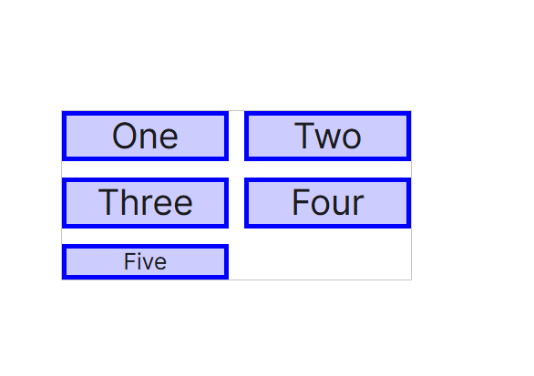

# 12 Flexbox布局
- 能让元素对不同的屏幕尺寸做好适应
- 盒指明空间的分布方式、内容的对齐方式和元素的视觉顺
- 盒依赖父子关系
- 在元素上声明display：flex或display：inline-flex该元素随之成为弹性容，控制子元素的布局
- 有直接子元素称为弹性元素
- **弹性盒的目的是实现一种特定的布局，即一维内容分布。也就是说，弹性盒最适合沿一个方向（或轴）布置内容。**
- 有时子元素的数量却不在我们的掌控之中，可能也不知道容器的宽度，使用弹性盒都能轻易解决


## 应用在弹性容器的属性
- **flex-direction**
如果你想要的布局是从上到下、从左至右、从右至左的，抑或是从下到上的，可以使用**flex-direction属性**控制排布弹性元素的主轴。
是从上到下、从左至右、从右至左的，抑或是从下到上
可以的值是row(默认) row-reverse column column-reverse
- **flex-wrap**
元素在弹性容器的主轴上放不下，默认情况下弹性元素不会换行，也不会自行调整尺寸，边界溢出
flex-wrap属性，允许弹性元素换行，变成多行或多列，或者缩减尺寸，挤在同一行。
取值nowrap wrap上 wrap-reverse

flex-flow属性是flex-direction和flex-wrap两个属性的简写形式

- **justify-content**
分配子元素的空余空间。
flex-start|flex-end|center|space-between|space-around|space-evenly

- **align-items**
决定容器内项目在竖直方向上的排列
stretch|flex-start|flex-end|center|baseline

- **align-content**
控制多行如何对齐
stretch|flex-start|flex-end|center|space-between|space-around|space-evenly

- **align-self**
为容器中的某个项目单独指定对齐方式
auto|stretch|flex-start|flex-end|center|baseline

---

- 依赖父子关系
- 容器显示为块or行内？display: flex; displ: inline-flex
- 弹性元素布局方向flex-direction
- 元素太多，容器空间不够怎么办，减小元素尺寸还是是否允许换行flex-wrap
- 空白怎么处理？主轴：justify-content 垂轴：align-items  align-self
- 元素对齐
- 一维


- flex-direction 4
- flex-wrap 3
- justify-content 6
- align-items 5
- align-self 6
- align-content 7


---

## 弹性元素
flex-grow、flex-shrink和flex-basis属性用于控制弹性元素的弹性。
这里所说的弹性是指弹性元素在主轴方向上可以增加或缩减多少尺寸。
它们可以简写为flex

如果 flex 简写属性没有显式声明增长因子（flex-grow）和缩减因子（flex-shrink），
则：增长因子 默认为 0。
缩减因子 默认为 1。

flex接受常规的全局属性值，包括initial、auto和none
initial 是一个 全局值，将属性恢复为默认值。flex: 0 1 auto;
auto 是 flex 的默认值，表示项目的大小由内容的自然宽度或高度决定。flex: 1 1 auto;
none 是一个特殊的值，表示不允许元素在容器中伸展、收缩，元素的大小将由 flex-basis 决定，flex: 0 0 auto;
flex: <number> 这个值把弹性元素的增长因子设为<number>指定的数，同时把缩减因子设为0，把基准也设为0。


如果是宽度不一样 缺少的空间/（（宽度1×缩减因子1）+...+（宽度N×缩减因子N））

flex-basis在分配空间前的初始尺寸，它可以是像素（px）或其他单位，默认为 auto（即项目的原始尺寸）。

min-width 是一个 CSS 属性，用于设置元素的 最小宽度，即元素的宽度不能小于该值。即使容器的宽度不足以容纳该元素，元素的宽度也不会小于 min-width 设置的值。
如果元素的实际内容宽度大于 min-width，那么这个元素的宽度将 根据内容的宽度自动扩展，而不会受 min-width 的限制。


order属性用于修改单个弹性元素/组的显示顺序

---

- flex-grow
- flex-shrink
- flex-basis
- min-width
- order - 0 +
- flex 4

---


----------------------------------------------------------------------------------------------------

# 13 栅格布局
栅格布局是普适的布局系统。依赖行和列栅格之内可以嵌套栅格，层级不限，而且还可以在栅格中使用表格或弹性容器

栅格有两种：常规栅格和行内栅格。这两种栅格使用display属性的特殊值创建：grid和inline-grid

其中的元素根据栅格布局（而非块级布局）规则排布，表格自身就是一种栅格系统


- 栅格轨道gridtrack
- 栅格单元gridcell
- 栅格区域gridarea


---

** grid-template-rows,grid-template-columns **

## grid-template-rows定义行线or行高

`grid-template-rows: 100px 5em 100px;`


`grid-template-rows: 40px 4em 40px;`


`grid-template-rows: 1fr 2fr 1fr;`


`grid-template-rows: 3ch auto minmax(10px, 60px);`


```
1. 关键字值

grid-template-rows: none;
- none: 该值表示没有显式的行定义，因此所有行将被隐式生成，其大小由 grid-auto-rows 属性控制。

2. <track-list> 值

grid-template-rows: 100px 1fr;
- 定义了两行：第一行高度为 100px，第二行高度占据剩余空间的 1fr。

grid-template-rows: [line-name] 100px;
- [line-name] 是一个行名标记，表示这一行的起始位置被命名为 line-name，高度为 100px。

grid-template-rows: [line-name1] 100px [line-name2 line-name3];
- 定义了三行的起始和结束位置：第一行高度 100px，并为该行指定了行名 line-name1，第二行的起始点命名为 line-name2，结束点命名为 line-name3。

grid-template-rows: minmax(100px, 1fr);
- 定义了一行，高度范围是 100px 到 1fr 之间，表示行的高度至少为 100px，最大为剩余空间的 1fr。

grid-template-rows: fit-content(40%);
- 定义了一行，高度计算为 max-content 和 40% 之间的较小值。也就是说，这行的高度最多为 40%，但不会小于内容的最大高度。

grid-template-rows: repeat(3, 200px);
- 定义了三行，每行高度为 200px。

grid-template-rows: subgrid;
- subgrid 表示该网格将在该轴上采用父网格的跨越部分，行的大小继承自父网格的定义。

grid-template-rows: masonry;
- masonry 值表示该轴应该按照砖石布局算法进行布局。

3. <auto-track-list> 值

grid-template-rows: 200px repeat(auto-fill, 100px) 300px;
- 定义了三行，其中第一行高度为 200px，接下来的行重复 100px，并且自动填充，最后一行高度为 300px。

grid-template-rows:
  minmax(100px, max-content)
  repeat(auto-fill, 200px) 20%;
- 定义了四行：第一行高度为 100px 到 max-content 之间的范围；接下来的行重复 200px，最后一行 20% 的高度。

grid-template-rows:
  [line-name1] 100px [line-name2]
  repeat(auto-fit, [line-name3 line-name4] 300px)
  100px;
- 定义了五行：第一行高度为 100px，并命名行名为 line-name1 和 line-name2；接下来重复自动适应的行，命名为 line-name3 和 line-name4，大小为 300px，最后一行 100px。

grid-template-rows:
  [line-name1 line-name2] 100px
  repeat(auto-fit, [line-name1] 300px) [line-name3];
- 定义了五行：第一行命名为 line-name1 和 line-name2，大小为 100px；接下来重复自动适应的行，命名为 line-name1，大小为 300px，最后一行命名为 line-name3。

4. 全局值

grid-template-rows: inherit;
- inherit: 继承父元素的 grid-template-rows 值。

grid-template-rows: initial;
- initial: 使用初始值，表示将 grid-template-rows 设置为其默认值。

grid-template-rows: revert;
- revert: 恢复到父元素的值。

grid-template-rows: revert-layer;
- revert-layer: 恢复到当前层的默认值。

grid-template-rows: unset;
- unset: 取消当前设置，等效于将值设为默认值或继承值，具体取决于上下文。

```


## grid-template-columns定义列线与列宽 

`grid-template-columns: 60px 60px;`


`grid-template-columns: 1fr 60px;`


`grid-template-columns: 1fr 2fr;`


`grid-template-columns: 8ch auto;`


```
1. 关键字值

grid-template-columns: none;
- none: 该值表示没有显式的列定义，因此所有列将被隐式生成，其大小由 grid-auto-columns 属性控制。

2. <track-list> 值

grid-template-columns: 100px 1fr;
- 定义了两列：第一列宽度为 100px，第二列宽度占据剩余空间的 1fr。

grid-template-columns: [line-name] 100px;
- [line-name] 是一个行名标记，表示这一列的起始位置被命名为 line-name，宽度为 100px。

grid-template-columns: [line-name1] 100px [line-name2 line-name3];
- 定义了三个列的起始和结束位置：第一列宽度 100px，并为该列指定了行名 line-name1，第二列的起始点命名为 line-name2，结束点命名为 line-name3。

grid-template-columns: minmax(100px, 1fr);
- 定义了一列，宽度范围是 100px 到 1fr 之间，表示列的宽度至少为 100px，最大为剩余空间的 1fr。

grid-template-columns: fit-content(40%);
- 定义了一列，宽度计算为 max-content 和 40% 之间的较小值。也就是说，这列的宽度最多为 40%，但不会小于内容的最大宽度。

grid-template-columns: repeat(3, 200px);
- 定义了三列，每列宽度为 200px。

grid-template-columns: subgrid;
- subgrid 表示该网格将在该轴上采用父网格的跨越部分，列的大小继承自父网格的定义。

grid-template-columns: masonry;
- masonry 值表示该轴应该按照砖石布局算法进行布局。

3. <auto-track-list> 值

grid-template-columns: 200px repeat(auto-fill, 100px) 300px;
- 定义了三列，其中第一列宽度为 200px，接下来会根据 auto-fill 自动填充剩余的 100px 宽度的列，最后一列宽度为 300px。

grid-template-columns:
  minmax(100px, max-content)
  repeat(auto-fill, 200px) 20%;
- 定义了四列：第一列宽度为 100px 到 max-content 之间的范围；第二列使用 auto-fill 填充 200px 宽度的列；第三列宽度为 20%，相对于网格容器的宽度。

grid-template-columns:
  [line-name1] 100px [line-name2]
  repeat(auto-fit, [line-name3 line-name4] 300px)
  100px;
- 定义了五列：第一列宽度为 100px，并命名行名为 line-name1 和 line-name2；第二列使用 auto-fit 填充 300px 宽度的列，命名为 line-name3 和 line-name4；最后一列宽度为 100px。

grid-template-columns:
  [line-name1 line-name2] 100px
  repeat(auto-fit, [line-name1] 300px) [line-name3];
- 定义了五列：第一列使用行名 line-name1 和 line-name2，宽度为 100px；第二列使用 auto-fit 填充 300px 宽度的列，命名行名为 line-name1；最后一列宽度为 300px，并命名为 line-name3。

4. 全局值

grid-template-columns: inherit;
- 继承父元素的 grid-template-columns 属性值。

grid-template-columns: initial;
- 使用初始值，表示元素会使用 CSS 规范中定义的默认值。

grid-template-columns: revert;
- 恢复元素的 grid-template-columns 属性为继承值（通常是父元素或全局样式中定义的值）。

grid-template-columns: revert-layer;
- 恢复到上一个样式层级中的值（如果适用）。

grid-template-columns: unset;
- 删除 grid-template-columns 的当前值，使其恢复为默认值（通常是 auto）。

总结：
- grid-template-columns 用于定义网格容器中列的布局，可以通过具体的宽度值、最小最大范围、重复模式、自动填充等方式来指定。
- 关键字如 none、subgrid、masonry 和全局值如 inherit、initial、unset 提供了灵活的布局控制。
- <track-list> 和 <auto-track-list> 值使得列的布局更具动态性和灵活性，允许根据内容大小或自动填充来调整列的尺寸。

通过这些不同的值，可以创建复杂的网格布局，适应不同的设计需求。

```


** grid-template-rows与grid-template-columns可以取得的值是 **

```

1. none
   - none: 该值表示没有显式的行定义，因此所有行将被隐式生成，其大小由 grid-auto-rows 属性控制。

2. [line-name]
   - [line-name]: <custom-ident> 形式，表示在该位置为该行指定名称。标识符可以是任何有效的字符串，不能是保留字 span 或 auto。多个行名可以通过空格分隔，例如 [line-name-a line-name-b]。

3. <length>
   - <length>: 非负长度值，用于定义列或行的尺寸。

4. <percentage>
   - <percentage>: 相对于网格容器的块级大小的非负百分比值。如果网格容器的大小取决于其轨道的大小，则百分比必须视为 auto，用于计算网格容器的固有尺寸。该尺寸的贡献可能会根据网格容器的大小进行调整，并可能增加轨道的最终大小，以最小化地满足百分比。

5. <flex>
   - <flex>: 非负的 fr 单位的维度，表示轨道的灵活因子。每个 flex 类型的轨道按比例分配剩余空间。如果出现在 minmax() 表达式外部，它表示一个自动的最小值（即 minmax(auto, <flex>)）。

6. max-content
   - max-content: 关键字，表示占据网格轨道的网格项的最大内容贡献。

7. min-content
   - min-content: 关键字，表示占据网格轨道的网格项的最小内容贡献。

8. minmax(min, max)
   - minmax(min, max): 一个函数表示定义了一个尺寸范围，该范围大于或等于 min，小于或等于 max。如果 max 小于 min，则 max 被忽略，函数将被视为 min。作为最大值，<flex> 值设置轨道的灵活因子，但它不能作为最小值。

9. auto
   - auto: 作为最大值，表示该轨道中项目的最大内容尺寸。
   - 作为最小值，表示该轨道中项目的最大最小尺寸（由项目的 min-width/min-height 指定），通常是 min-content 的大小。
   - 如果在 minmax() 表达式外使用，auto 表示描述的最小和最大之间的范围。这通常表现为 minmax(min-content, max-content)。

   - 注意: 只有 auto 尺寸的轨道可以通过 align-content 和 justify-content 属性进行拉伸。因此，默认情况下，auto 尺寸的轨道将占据网格容器中的所有剩余空间。

10. fit-content( [ <length> | <percentage> ] )
    - fit-content([<length> | <percentage>]): 表示公式 min(max-content, max(auto, argument))，类似于 auto，即 minmax(auto, max-content)，除了当轨道尺寸大于 auto 最小值时，尺寸会被限制为传递给 fit-content() 的参数。

11. repeat([ <positive-integer> | auto-fill | auto-fit ], <track-list>)
    - repeat([<positive-integer> | auto-fill | auto-fit], <track-list>): 表示重复的轨道列表片段，允许写出许多展现出重复模式的行，并以更紧凑的形式编写。

12. masonry
    - masonry: 该值指示该轴应根据砖砌算法进行布局。

13. subgrid
    - subgrid: 该值指示该网格将采用其父网格在该轴上的跨越部分。网格的行/列尺寸将从父网格的定义中获取，而不是显式地指定。

```


---

## grid-template-areas 在已经有的网格划地为王or自立门户
 
`grid-template-areas: 
            "a a a"
            "b c c"
            "b c c";`


`grid-template-areas: 
            "b b a"
            "b b c"
            "b b c";`


`grid-template-areas: 
            "a a ."
            "a a ."
            ". b c";`


```
1. 关键字值

grid-template-areas: none;
- none: 该值表示没有显式的区域定义，因此所有区域将被隐式生成，其大小由 `grid-auto-rows` 或 `grid-auto-columns` 属性控制。

2. <string> 值

grid-template-areas: "a b";
- "a b": 定义了两列，第一列为 `a`，第二列为 `b`，并且它们分别占据各自的区域。

grid-template-areas:
  "a b ."
  "a c d";
- 该定义表示在网格中有两行，第一行的 `a` 和 `b` 占据各自的区域，第三个位置是空的（用 `.` 表示）。第二行的 `a`、`c` 和 `d` 分别占据自己的区域。

3. 全局值

grid-template-areas: inherit;
- inherit: 该值表示从父元素继承 `grid-template-areas` 属性的值。

grid-template-areas: initial;
- initial: 该值表示将 `grid-template-areas` 属性的值重置为其初始值。

grid-template-areas: revert;
- revert: 该值表示恢复为上一个层叠上下文中的值。

grid-template-areas: revert-layer;
- revert-layer: 该值表示恢复为当前层叠上下文的上一个值。

grid-template-areas: unset;
- unset: 该值表示将 `grid-template-areas` 的值重置为其自然状态（即继承或初始值）。

```


建议一直显式命名栅格区域，隐式生成-start和-end形式的栅格线名称，不要反过来做。

## grid-template定义网格的集大成者

关于grid-template-rows与grid-template-columns与grid-template-areas，有一个组合的CSS属性：
`grid-template: (areas row) ... / columns	`

`grid-template: 
            "a a a" 40px
            "b c c" 40px
            "b c c" 40px / 1fr 1fr 1fr;`


`grid-template: 
            "b b a" auto
            "b b c" 2ch
            "b b c" 1em / 20% 20px 1fr;`


`grid-template: 
            "a a ." minmax(50px, auto)
            "a a ." 80px
            "b b c" auto / 2em 3em auto;`


## 使用栅格元素的grid-row-start与grid-row-end，二者是兄弟一起来，结合版是grid-row

`grid-row-start: auto;`


`grid-row-start: auto;`


`grid-row-start: auto;`


`grid-row-start: auto;`


```
/* Keyword value */
grid-row-start: auto;

/* <custom-ident> values */
grid-row-start: some-grid-area;

/* <integer> + <custom-ident> values */
grid-row-start: 2;
grid-row-start: some-grid-area 4;

/* span + <integer> + <custom-ident> values */
grid-row-start: span 3;
grid-row-start: span some-grid-area;
grid-row-start: 5 some-grid-area span;

/* Global values */
grid-row-start: inherit;
grid-row-start: initial;
grid-row-start: revert;
grid-row-start: revert-layer;
grid-row-start: unset;

```

```
1. auto
   - auto: 该值表示属性不会对网格项的定位做出贡献，意味着自动定位、自动跨越，或默认跨越 1 个网格单元。

2. [<custom-ident>]
   - [<custom-ident>]: 如果存在名为 `<custom-ident>-start` 的命名网格线，它会为网格项提供该命名网格线作为起始位置。
   - 注意：命名的网格区域会自动生成类似的隐式命名网格线，因此使用 `grid-row-start: foo;` 会选择该命名区域的起始位置（除非在此之前显式地指定了一个名为 `foo-start` 的网格线）。

3. <integer> 和 <custom-ident>
   - <integer> 和 <custom-ident>: 为网格项提供第 n 条网格线的位置。如果指定了负整数，则从网格的结束边缘向回计数。
   - 如果给定了 `<custom-ident>`，则只有该命名网格线会被计数。如果该命名网格线不足，则所有隐式网格线将被假定为该名称，以便查找此位置。
   - 0 是无效的整数值。

4. span 和 [ <integer> || <custom-ident> ]
   - span 和 [ <integer> || <custom-ident> ]: 为网格项提供网格跨越的起始位置；即网格项的行起始边距离结束边缘有 n 条网格线。
   - 如果给定了 `<custom-ident>`，则只有该命名网格线会被计数。如果该命名网格线不足，则假定所有隐式网格线都拥有该名称，以便在查找时计算跨越。
   - 如果省略了 `<integer>`，它默认为 1。负整数或 0 是无效的。
   - `<custom-ident>` 不能使用 `span` 值。

```


** 那么grid-row呢？ **

`grid-row: 1;`


`grid-row: 1 / 3;`


`grid-row: 2 / -1;`


`grid-row: 1 / span 2;`


```
1. auto
   - auto: 该值表示自动定位网格项，自动跨越，或默认跨越 1 个网格单元。

2. <custom-ident> 值
   - <custom-ident>: 为网格项指定一个命名区域，如 `some-grid-area`，用于确定网格项的起始位置。

3. <integer> + <custom-ident> 值
   - <integer> + <custom-ident>: 为网格项指定起始位置，如 `grid-row: some-grid-area 4;` 表示选择名为 `some-grid-area` 的网格线，且跨越 4 条网格线。
   - `grid-row: 4 some-grid-area / 6;` 表示从第 4 条网格线开始，跨越名为 `some-grid-area` 的网格线，并在第 6 条网格线结束。

4. span + <integer> + <custom-ident> 值
   - span + <integer> + <custom-ident>: 为网格项提供跨越起始位置和跨越范围，例如 `grid-row: span 3;` 表示从当前行开始，跨越 3 行。
   - `grid-row: span some-grid-area;` 表示从名为 `some-grid-area` 的网格线开始跨越。
   - `grid-row: 5 some-grid-area span;` 表示从第 5 条网格线开始，跨越 `some-grid-area`，并最终达到一个自动计算的结束位置。
   - `grid-row: span 3 / 6;` 表示从当前位置开始跨越 3 行，结束于第 6 条网格线。
   - `grid-row: span some-grid-area / span some-other-grid-area;` 表示从 `some-grid-area` 开始跨越，并在 `some-other-grid-area` 结束。
   - `grid-row: 5 some-grid-area span / 2 span;` 表示从第 5 条网格线开始，跨越 `some-grid-area`，结束于第 2 条网格线，继续跨越。

5. 全局值
   - inherit: 继承父元素的 `grid-row` 属性值。
   - initial: 设置 `grid-row` 为初始值。
   - revert: 恢复为默认或用户代理的 `grid-row` 属性值。
   - revert-layer: 恢复为层级特定的默认值。
   - unset: 将 `grid-row` 设置为未定义，继承或使用初始值。

```


## grid-area

将栅格元素放在对应的栅格或者区域，
可以通过命名区域或者行列线来定位网格项的位置

```
1. auto
   - auto: 该值表示自动布局网格项的位置或大小，具体由浏览器计算决定，通常用于自动放置或自动跨越。

2. auto / auto
   - auto / auto: 设置网格项的起始和结束位置均为自动，即由浏览器根据需要自动分配。

3. auto / auto / auto
   - auto / auto / auto: 设置网格项的起始和结束位置自动，并且还包含了行和列的默认行为，允许浏览器自动决定其布局。

4. auto / auto / auto / auto
   - auto / auto / auto / auto: 同时设置了网格项的行起始、列起始、行结束、列结束位置均为自动。

5. <custom-ident> 值
   - <custom-ident>: 该值表示为网格项指定一个命名区域（如 `some-grid-area`），可以通过 `grid-template-areas` 将其进行位置化。

6. <integer> && <custom-ident>? 值
   - <integer> && <custom-ident>: 表示在指定位置为网格项定义行和列的起始位置，例如 `grid-area: 4 some-grid-area;` 表示该网格项位于第 4 条行和 `some-grid-area` 列。
   - `grid-area: 4 some-grid-area / 2 another-grid-area;` 表示网格项位于第 4 条行的 `some-grid-area` 列，结束于第 2 列的 `another-grid-area`。

7. span && [ <integer> || <custom-ident> ] 值
   - span && <integer> 或 <custom-ident>: 用于指定网格项跨越的行数或列数。例如 `grid-area: span 3;` 表示网格项跨越 3 行或 3 列。
   - `grid-area: span 3 / span some-grid-area;` 表示网格项跨越 3 行，且在列上跨越 `some-grid-area`。
   - `grid-area: 2 span / another-grid-area span;` 表示从第 2 行开始跨越，列从 `another-grid-area` 跨越到 `span`。

8. 全局值
   - inherit: 继承父元素的 `grid-area` 属性值。
   - initial: 设置 `grid-area` 为初始值。
   - revert: 恢复为默认或用户代理的 `grid-area` 属性值。
   - revert-layer: 恢复为层级特定的默认值。
   - unset: 将 `grid-area` 设置为未定义，继承或使用初始值。

```


```
1. auto
   - auto: 该值表示该属性不对网格项的位置做出贡献，指示自动布局或默认跨越 1 个格子。

2. <custom-ident>
   - <custom-ident>: 如果有名为 `<custom-ident>-start` 或 `<custom-ident>-end` 的行，网格项将使用这些行作为其位置的起始或结束位置。
   - 注意：命名的网格区域会自动生成这样的隐式命名行，因此指定 `grid-area: foo;` 会选择该命名网格区域的开始/结束边缘（除非在之前明确指定了名为 `foo-start` 或 `foo-end` 的行）。

3. <integer> && <custom-ident>?
   - <integer> && <custom-ident>: 表示网格项的网格位置，指定第 n 条网格线作为网格项的位置。如果指定了负整数，则从显式网格的末尾开始倒计数。
   - 如果给定了 `<custom-ident>` 作为名称，只有该名称对应的行会被计算。如果没有足够的行，所有隐式网格行都会被假定具有该名称，以便找到该位置。
   - 注意：`<integer>` 的值为 0 是无效的。

4. span && [ <integer> || <custom-ident> ]
   - span && [ <integer> || <custom-ident> ]: 表示网格项的跨越范围，指定网格项所在位置的相应边缘距离其对边的 n 条网格线。
   - 如果指定了 `<custom-ident>` 作为名称，只有该名称对应的行会被计算。如果没有足够的行，所有隐式网格行都会被假定具有该名称，以便计算跨越范围。
   - 如果省略了 `<integer>`，则默认为 1。负整数或 0 是无效的。

```


## grid-auto-rows和他的好兄弟grid-auto-columns


`grid-auto-rows: auto;`



`grid-auto-rows: 50px;`


`grid-auto-rows: min-content;`


`grid-auto-rows: minmax(30px, auto);`


```
1. **关键字值**
   - `grid-auto-rows: min-content;`  
     该值表示行的高度根据内容的最小尺寸来确定，即内容的最小高度。
   - `grid-auto-rows: max-content;`  
     该值表示行的高度根据内容的最大尺寸来确定，即内容的最大高度。
   - `grid-auto-rows: auto;`  
     该值表示行的高度自动调整，取决于内容的自然尺寸。

2. **<length> 值**
   - `grid-auto-rows: 100px;`  
     设置行的高度为固定的 100px。
   - `grid-auto-rows: 20cm;`  
     设置行的高度为固定的 20cm。
   - `grid-auto-rows: 50vmax;`  
     设置行的高度为 50vmax，`vmax` 为视口的较大维度（宽度或高度）的 50%。

3. **<percentage> 值**
   - `grid-auto-rows: 10%;`  
     设置行的高度为视口高度的 10%。
   - `grid-auto-rows: 33.3%;`  
     设置行的高度为容器宽度的 33.3%。

4. **<flex> 值**
   - `grid-auto-rows: 0.5fr;`  
     设置行的高度为容器的 0.5fr（分数单位，表示占据容器剩余空间的比例）。
   - `grid-auto-rows: 3fr;`  
     设置行的高度为容器的 3fr，表示占据剩余空间的 3 份。

5. **minmax() 值**
   - `grid-auto-rows: minmax(100px, auto);`  
     设置行的高度为 100px 到自动高度之间的最小和最大值。
   - `grid-auto-rows: minmax(max-content, 2fr);`  
     设置行的高度为从内容的最大高度（`max-content`）到 2fr 之间的值。
   - `grid-auto-rows: minmax(20%, 80vmax);`  
     设置行的高度为 20% 到 80vmax 之间的最小和最大值。

6. **fit-content() 值**
   - `grid-auto-rows: fit-content(400px);`  
     设置行的高度为内容的最大高度，最多为 400px。
   - `grid-auto-rows: fit-content(5cm);`  
     设置行的高度为内容的最大高度，最多为 5cm。
   - `grid-auto-rows: fit-content(20%);`  
     设置行的高度为内容的最大高度，最多为 20% 的容器高度。

7. **多个 track-size 值**
   - `grid-auto-rows: min-content max-content auto;`  
     设置多个行的高度，分别为 `min-content`，`max-content` 和 `auto`。
   - `grid-auto-rows: 100px 150px 390px;`  
     设置多个行的高度分别为 100px、150px 和 390px。
   - `grid-auto-rows: 10% 33.3%;`  
     设置多个行的高度分别为 10% 和 33.3%。
   - `grid-auto-rows: 0.5fr 3fr 1fr;`  
     设置多个行的高度分别为 0.5fr、3fr 和 1fr。
   - `grid-auto-rows: minmax(100px, auto) minmax(max-content, 2fr) minmax(20%, 80vmax);`  
     设置多个行的高度，分别为 `minmax(100px, auto)`、`minmax(max-content, 2fr)` 和 `minmax(20%, 80vmax)`。
   - `grid-auto-rows: 100px minmax(100px, auto) 10% 0.5fr fit-content(400px);`  
     设置多个行的高度，分别为 100px、`minmax(100px, auto)`、10%、0.5fr 和 `fit-content(400px)`。

8. **全局值**
   - `grid-auto-rows: inherit;`  
     从父元素继承 `grid-auto-rows` 的值。
   - `grid-auto-rows: initial;`  
     设置为初始值，即 `auto`。
   - `grid-auto-rows: revert;`  
     恢复到上一个有效值。
   - `grid-auto-rows: revert-layer;`  
     恢复到上一个有效值（仅对某些层级有效）。
   - `grid-auto-rows: unset;`  
     清除当前值，恢复到默认行为。

```


```
1. **<length>**
   - 这是一个非负的长度值。

2. **<percentage>**
   - 这是一个非负的百分比值，相对于网格容器的块级尺寸。当网格容器的块级尺寸不确定时，百分比值将被视为 `auto`。

3. **<flex>**
   - 这是一个非负的维度，单位为 `fr`，表示该轨道的弹性因子。每个 `<flex>` 尺寸的轨道按其弹性因子从剩余空间中分配空间。
   - 当出现在 `minmax()` 语法之外时，意味着自动最小值（即 `minmax(auto, <flex>)`）。

4. **max-content**
   - 这是一个关键字，表示占据该网格轨道的网格项的最大内容贡献。

5. **min-content**
   - 这是一个关键字，表示占据该网格轨道的网格项的最小内容贡献。

6. **minmax(min, max)**
   - 这是一个功能性表示法，定义了一个大小范围，其中 `min` 大于或等于该值，`max` 小于或等于该值。如果 `max` 小于 `min`，则会忽略 `max`，并将该函数视为 `min`。
   - 作为最大值时，`<flex>` 值设置了轨道的弹性因子。
   - 作为最小值时，它被视为零（或者如果网格容器在最小内容约束下进行调整，则为最小内容）。

7. **fit-content( [ <length> | <percentage> ] )**
   - 这个值表示公式 `min(max-content, max(auto, argument))`，其计算方式类似于 `auto`（即 `minmax(auto, max-content)`），只是当给定的 `argument` 大于自动最小值时，轨道尺寸被限制在该值。

8. **auto**
   - 作为最大值，`auto` 表示该轨道上项的最大 `max-content` 尺寸。
   - 作为最小值，`auto` 表示该轨道上项的最大最小尺寸（由项的 `min-width`/`min-height` 指定）。这通常（但不总是）为 `min-content` 尺寸。
   - 如果在 `minmax()` 语法之外使用，`auto` 表示上述描述的最小和最大范围。这通常表现为 `minmax(min-content, max-content)`。

```


## grid-auto-flow

`grid-auto-flow: row;`


`grid-auto-flow: column;`


`grid-auto-flow: row dense;`


```
1. **关键字值**
   - `grid-auto-flow: row;`  
     将网格项按行的顺序自动排列。
   - `grid-auto-flow: column;`  
     将网格项按列的顺序自动排列。
   - `grid-auto-flow: dense;`  
     在自动放置网格项时，尽量填充空白区域，密集地排列项。
   - `grid-auto-flow: row dense;`  
     将网格项按行的顺序自动排列，并尽量填充空白区域。
   - `grid-auto-flow: column dense;`  
     将网格项按列的顺序自动排列，并尽量填充空白区域。

2. **全局值**
   - `grid-auto-flow: inherit;`  
     从父元素继承 `grid-auto-flow` 属性的值。
   - `grid-auto-flow: initial;`  
     设置属性为初始值。
   - `grid-auto-flow: revert;`  
     将属性值恢复到继承的默认值。
   - `grid-auto-flow: revert-layer;`  
     恢复属性值到上层的继承值。
   - `grid-auto-flow: unset;`  
     清除属性，恢复到默认值。

```


```
1. **row**
   - 项目按顺序填充每一行，必要时会添加新行。如果没有指定 `row` 或 `column`，则默认使用 `row`。

2. **column**
   - 项目按顺序填充每一列，必要时会添加新列。

3. **dense**
   - `"dense"` 填充算法试图在网格中填补空洞，当较小的项目随后出现时。这样做可能会导致项目显示出顺序不一致，但能填补由较大项目留下的空白。
   - 如果省略该值，则使用 `"sparse"` 算法，在该算法中，放置项目时，布局算法只会“向前”移动，永远不会回溯去填补空白。这样可以确保所有自动放置的项目按照顺序出现，即使这可能会留下可以被后续项目填补的空洞。

```


## grid

`grid: auto-flow / 1fr 1fr 1fr;`


`grid: auto-flow dense / 40px 40px 1fr;`


`grid: repeat(3, 80px) / auto-flow;`


```
1. **<'grid-template'> 值**
   - `grid: none;`  
     不使用任何网格布局，清除当前的网格设置。
   - `grid: "a" 100px "b" 1fr;`  
     设置两个命名的网格区域 `"a"` 和 `"b"`，分别指定了固定的 100px 和剩余的 1fr 空间。
   - `grid: [line-name1] "a" 100px [line-name2];`  
     设置命名行线 `line-name1` 和 `line-name2`，并指定 `"a"` 区域占 100px。
   - `grid: "a" 200px "b" min-content;`  
     设置 `"a"` 区域为 200px，`"b"` 区域为最小内容大小。
   - `grid: "a" minmax(100px, max-content) "b" 20%;`  
     设置 `"a"` 区域为 100px 和最大内容之间的最小最大尺寸，`"b"` 区域为 20%。
   - `grid: 100px / 200px;`  
     设置网格的行和列分别为 100px 和 200px。
   - `grid: minmax(400px, min-content) / repeat(auto-fill, 50px);`  
     设置行的最小最大尺寸为 400px 到最小内容，列使用 `auto-fill` 进行重复，宽度为 50px。

2. **<'grid-template-rows'> / [auto-flow && dense?] <'grid-auto-columns'>? 值**
   - `grid: 200px / auto-flow;`  
     设置网格的行高度为 200px，列使用自动流布局。
   - `grid: 30% / auto-flow dense;`  
     设置网格的行高度为 30%，列使用自动流布局并启用密集填充（dense）。
   - `grid: repeat(3, [line1 line2 line3] 200px) / auto-flow 300px;`  
     设置网格的行使用 `repeat(3)` 重复 3 次，列使用自动流布局，宽度为 300px。
   - `grid: [line1] minmax(20em, max-content) / auto-flow dense 40%;`  
     设置行从 `line1` 开始，尺寸为 20em 到最大内容，列使用自动流布局并启用密集填充，宽度为 40%。

3. **[auto-flow && dense?] <'grid-auto-rows'>? / <'grid-template-columns'> 值**
   - `grid: auto-flow / 200px;`  
     设置列使用自动流布局，行高度为 200px。
   - `grid: auto-flow dense / 30%;`  
     设置列使用自动流布局并启用密集填充，行高度为 30%。
   - `grid: auto-flow 300px / repeat(3, [line1 line2 line3] 200px);`  
     设置列使用自动流布局并将列宽度设置为 300px，行使用 `repeat(3)` 重复 3 次。
   - `grid: auto-flow dense 40% / [line1] minmax(20em, max-content);`  
     设置列使用自动流布局并启用密集填充，行高度为 40%，行从 `line1` 开始，尺寸为 20em 到最大内容。

4. **全局值**
   - `grid: inherit;`  
     继承父元素的 `grid` 属性值。
   - `grid: initial;`  
     设置 `grid` 为初始值。
   - `grid: revert;`  
     恢复到上一个样式表的 `grid` 属性值。
   - `grid: revert-layer;`  
     恢复到上一层级的 `grid` 属性值。
   - `grid: unset;`  
     将 `grid` 设置为未定义状态。

```


```
1. **<'grid-template'>**
   - 定义了整个网格布局，包括 `grid-template-columns`、`grid-template-rows` 和 `grid-template-areas`。

2. **<'grid-template-rows'> / [auto-flow && dense?] <'grid-auto-columns'>?**
   - 通过显式设置 `grid-template-rows` 属性来设置行轨道，并通过 `grid-template-columns` 属性将其设置为 `none`，同时指定如何通过 `grid-auto-columns` 来自动重复列轨道（并将 `grid-auto-rows` 设置为 `auto`）。`grid-auto-flow` 也会相应地设置为 `column`，如果指定了 `dense`，则启用密集填充。

   所有其他网格子属性将被重置为其初始值。

3. **[auto-flow && dense?] <'grid-auto-rows'>? / <'grid-template-columns'>**
   - 通过显式设置 `grid-template-columns` 属性来设置列轨道，并将 `grid-template-rows` 属性设置为 `none`，同时指定如何通过 `grid-auto-rows` 来自动重复行轨道（并将 `grid-auto-columns` 设置为 `auto`）。`grid-auto-flow` 也会相应地设置为 `row`，如果指定了 `dense`，则启用密集填充。

   所有其他网格子属性将被重置为其初始值。

```


``


``


栏距
row-gap 和 column-gap


栅格对齐


分层和排序
z-index		order


如果栅格元素（或其一部分）超出了显式定义的栅格呢？


----------------------------------------------------------------------------------------------------


# 选择器
# 层叠
# 值和单位
# 字体
# 文本属性
# 视觉格式化基础
# 盒模型
# 颜色背景和渐变


---
# 定位
可以相对自己，相对其他，相对浏览器

定位有五种类型
定位类型使用position属性指定
static|relative|sticky|absolute|fixed

static正常
relative元素框相对自己偏移一定的距离，未脱离文档流
absolute脱离文档流找非static爸爸爷爷
fixed浏览器窗口粉丝
sticky一开始正常，达到触发粘滞的条件时脱颖而出，占据的空间得以保。条件失效后，元素回到常规文档流中最初的位置。

它们的属性是：
top|right|bottom|left

min-width, min-height

Overflow visible|hidden|scroll|auto

visibility visible|hidden|collapse
在不可见状态下，元素依然像可见时那样影响文档的布局。也就是说，元素还在那里，只是你看不见，就像声明opacity：o一样。
注意这与display：none之间的区别。后者导致元素不显示，完全从文档中移除，因此对文档的布局不再有任何影响。


---


# flex


# grid


# 表格 4

# 列表


# 过渡
CSS过渡能控制一段时间内属性的值如何变成另一个值。因此，我们可以让属性的值逐渐变化，自然一些，不那么突兀。

过渡事件

在CSS中，过渡使用四个属性定义：
- transition-property
- transition-duration
- transition-timing-function
- transition-delay。
简写属性transition，可一次声明全部四个属性。

transition-property 该元素的哪些动画属性将会被过渡none all IDENT

transition-duration可以指定多个时长，每个时长会被应用到由 transition-property 指定的对应属性上。如果指定的时长个数小于属性个数，那么时长列表会重复。

transition-timing-function用来调整内部时序

transition-delay一定延迟

# 动画

# 滤镜


--浮动
在CSS中，浮动通过float属性实现
left|right|none
浮动的最常见用途之一是图文混排

--变形

--特指度